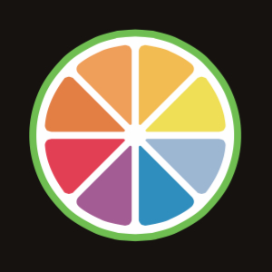
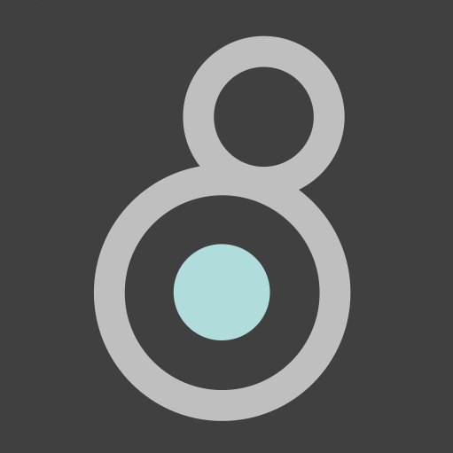
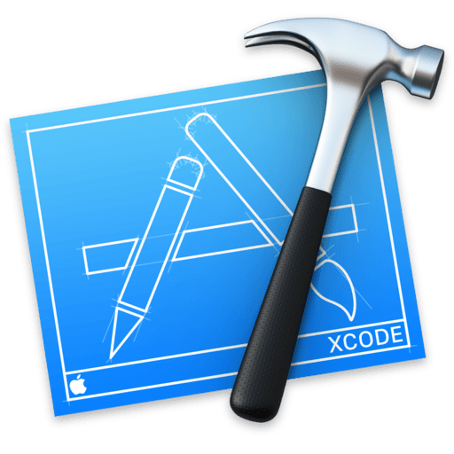
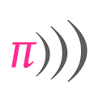

<!--
  **carmelofascella/carmelofascella** is a ✨ _special_ ✨ repository because its `README.md` (this file) appears on your GitHub profile.

Here are some ideas to get you started:

- 🔭 I’m currently working on ...
- 🌱 I’m currently learning ...
- 👯 I’m looking to collaborate on ...
- 🤔 I’m looking for help with ...
- 💬 Ask me about ...
- 📫 How to reach me: ...
- 😄 Pronouns: ...
- ⚡ Fun fact: ...

-->

## Hi there, I'm Carmelo 👋

- 🔭 Currently working as Audio Software Engineer and Researcher @ [Brandenburg Labs][brandenburg-labs].
- 💡 Focus: Music Tech, DSP, Spatial Audio and AI Audio applications.
- 👨‍💻 Interested in developing Music Software Tools for Musicians and Artists.
- 👨‍🎤 Musician and Live-coder.
- 🎓 MSc Graduated in Computer Science @ Politecnico di Milano specializing in Audio Technologies and AI/ML.
- 🌍 Internship @ International Audio Laboratories Erlangen on Music Information Retrieval.

## Languages and Tools:

 

## Connect with me

[][linkedin]

<!-- Links  -->

[linkedin]: https://www.linkedin.com/in/carmelo-fascella/
[brandenburg-labs]: https://brandenburg-labs.com/
